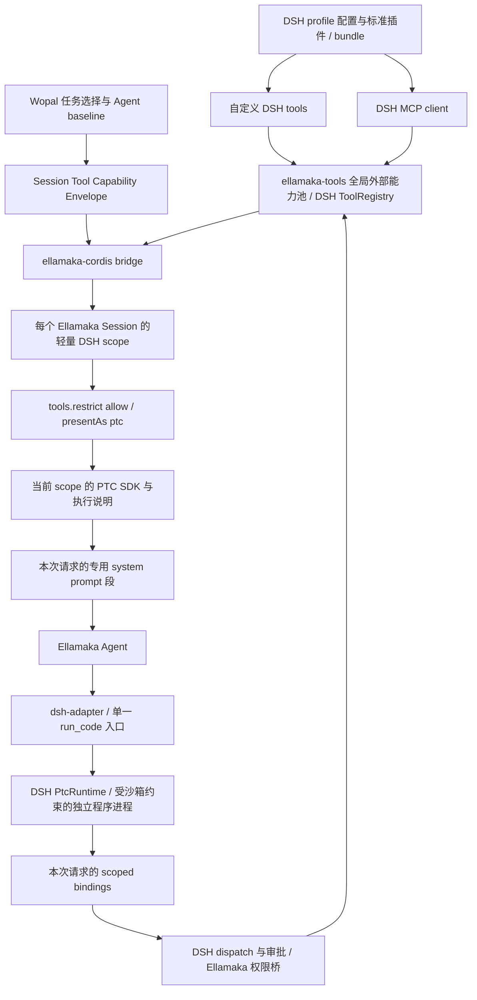

# enhance-session-assembly

## Metadata

- **Type**: enhance
- **Project Path**: .wopal
- **Created**: 2026-09-27
- **Updated**: 2026-10-08
- **Stage**: draft
- **Mode**: (accept 时记录：isolated | quick)
- **Worktree**: (accept 时记录)
- **Branch**: (accept 时记录)
- **Base Commit**: (accept 时记录)
- **Final Commit**: (integrate 时记录：集成到空间分支后的提交)

## Scope Assessment

- **Complexity**: High
- **Confidence**: High — Session Assembly 的总体边界已经收敛；Skill、Tool、Rule 三类能力的运行时语义不同，应拆成三个独立 Evolution Proposal 分别设计、评审和实施；本轮已确认的 tools 核心架构先在 umbrella 保存。

## Goal

定义 Wopal Session Assembly 的总体目标、共同约束与交付拆分：主 Agent 根据具体任务，为主会话或受管子会话叠加所需能力，同时将 Skill、Tool、Rule 分成三个独立 Evolution Proposal 分别演进；本轮先记录 tools 决策，DSH 基线升级完成后再拆 Tool/Rule 子提案。

## Technical Context

### Architecture Context

WopalSpace 已经有三层稳定事实：空间物化后的能力池、Agent 的角色默认能力，以及 Session 的运行态。Stage 2 要补的是第四层：主 Agent 根据任务，把角色默认能力之外的能力叠加到具体 Session。

原提案把 Skill、Tool、Rule 放在同一个交付里，并试图用一套 Session Capability Envelope 同时解释能力发现、授权、模型可见性和上下文注入。进一步研究后确认三类能力生命周期不同：

- Skill 是“能力目录 + 按需加载正文/资源”，动态选择不等于动态改 Tool schema；
- Tool 涉及模型 tool schema、执行入口、MCP/DSH scope 与授权，缓存和安全边界与 Skill 不同；
- Rule 是运行时指导上下文，核心问题是匹配时机、事实来源和 request-tail 注入，不等同于执行权限。

因此本提案成为 Session Assembly 的 umbrella proposal：保留总体原则、拆分关系和已确认的领域设计输入，不直接承担三个能力域的实施。tools 的核心架构先记录于本提案；DSH 基线升级完成后再拆独立子提案，各自拥有接口、验收标准和实施生命周期。

权威设计参考：

- `docs/DESIGN-capabilities.md`
- `docs/DESIGN-wopal-plugin.md`
- Ellamaka `docs/DESIGN.md` 的 Capability Discovery、Session Capability Contract、Runtime Context Contribution

### Research Findings

1. Ellamaka discovery 提供引擎已加载的 Skill/Rule 和原生工具事实。动态外部 tools/MCP 的权威来源是 DSH ellamaka-tools 的 ToolRegistry；Ellamaka/Bridge 只提供其派生发现出口，Wopal 不建立第二套可写 registry。
2. Agent frontmatter/config 是角色默认能力；任务装配应叠加在 baseline 之上，而不是改写角色定义。
3. 动态能力不应为了统一接口而强迫使用同一种运行时机制。Skill、Tool、Rule 可以共享 Session Assembly 概念，但其模型可见性、授权和恢复方式应由各自子提案定义。
4. Prompt prefix cache 是共同约束：动态变化应尽量发生在稳定 system/tool prefix 之后，不能为了运行时装配频繁重写 system prompt。
5. 已有 Ellamaka/Wopal-plugin 扩展点优先复用。只有现有 seam 无法表达且确属通用引擎能力时，才增加最小的 Ellamaka core/plugin SDK 扩展。

### Key Decisions

- D-01: `enhance-session-assembly` 是 umbrella proposal，只定义 Session Assembly 总体目标、共同不变量和子提案关系，记录已确认的 tools 架构作为拆分输入，不直接实施 Skill/Tool/Rule。
- D-02: Session Assembly 拆成三个独立 Evolution Proposal：Skill、Tool、Rule。每个子提案独立经历 draft → accepted → implementing → validating → archived。
- D-03: Skill 子提案 `enhance-session-skill` 已独立实施、验证并归档。Tool 的已确认设计继续由本 umbrella 保留，Tool/Rule 子提案在 DSH 升级完成后独立拆分；本提案不冻结它们的最终 wire contract。
- D-04: 能力发现保持所属引擎的来源边界：动态外部 tools/MCP 的唯一真相源为 DSH ToolRegistry，其他原生能力由 Ellamaka discovery 提供。Wopal 负责选择和装配，不复制 registry 或完整 permission evaluator。
- D-05: Agent 配置是 baseline，Session Assembly 是 additive overlay。是否支持 revoke/subtract/exact-set 由各子提案单独论证，不能从一个能力域外推到另一个能力域。
- D-06: 动态装配必须保护稳定 prompt prefix。运行时变化不得无必要地改写 system prompt；是否影响 tool schema、使用 request-tail 或其他 scope，由各子提案根据能力特性决定。
- D-07: 模型“看得到能力”和“实际能使用能力”必须来自同一 Session 事实源。每个子提案都必须证明可见性与执行/加载边界不会形成双真相源。
- D-08: Session metadata 可以承载 wopal-plugin 私有装配事实；SessionStore/cache 只能是派生状态，不能成为恢复后的唯一授权事实。
- D-09: 主 Agent 可以为主会话或受管子会话做任务级能力选择；获得某项能力不会自动授予派发、沙箱、文件写入或其他无关能力。
- D-10: 安全上限仍由引擎、沙箱和 profile 等硬边界拥有。Session Assembly 不能通过业务层 overlay 绕过不可提升的执行边界。
- D-11: Skill/Tool/Rule 子提案必须小步交付。一个子提案完成不能解释为其他两类能力已经获得相同动态语义。
- D-12: 本 umbrella 保持 `draft`，作为 Stage 2 编排真相源；它本身不创建实施 worktree。三个子提案独立交付后，再由用户决定 umbrella 的归档方式。

### Tool Design Decisions for Later Split

本节记录本轮已经确认的 tools 架构，作为后续 Tool 子提案的设计输入。它不承担 tools 实施，也不把 Skill 或 Rule 的运行时接口推广到 Tool。Tool 的最终 wire contract、错误码和实施任务在 DSH 基线升级完成后由独立子提案定义。

#### Architecture Diagram



图中的 global pool 是当前 Ellamaka 进程的共享池，不是跨进程 registry。scope、SDK、bindings 与权限桥始终对应同一个 Ellamaka Session 和请求绑定。

#### Mounting and Ownership

- T-01 — **DSH 是唯一外部工具真相源**：所有动态外部能力，包括自定义 DSH tools 与 MCP，使用 DSH profile 配置和插件机制在 ellamaka-tools 安装、连接、挂载与注销。Ellamaka 不逐项把这些外部工具注册进自身 ToolRegistry，也不维护第二份可写外部工具表。
- T-02 — **进程池与 Session 视图分离**：外部工具挂载在 ellamaka-tools 的 host 层。Ellamaka Session 创建轻量 DSH scope，通过 tools.restrict({ allow }) 收窄到已授权底层工具，再用 presentAs("ptc") 提供原生 run_code。DSH Web preset 私有工具不自动进入这个可授权池。
- T-03 — **保持 Ellamaka 会话所有权**：scope 不启动 DSH agent-loop，不创建持久 DSH Session，也不要求挂载完整 PTC preset。执行需要的 cwd、归属标签、内存事件与审批外观由桥提供；scope key、执行上下文与绑定视图必须使用同一身份。
- T-04 — **责任分层**：wopal-plugin 负责任务能力选择和 envelope 事实；ellamaka-cordis bridge 负责共享池、scope、provider、SDK/bindings 请求绑定及生命周期；dsh-adapter 负责 Ellamaka 的 run_code 接入、上下文和权限/结果桥。DSH 负责真实工具注册、MCP 生命周期、PTC 程序与子工具调度。adapter 不另造 registry 或 JavaScript 执行器。

#### Capability Envelope and Permissions

- T-05 — **只保存授权意图**：工具域 envelope 描述 baseline、任务增量 grant 和最终允许的稳定工具标识。首次请求前校验并确定初始集合；未知或不可用能力明确拒绝，不通过临时安装补齐。run_code 是呈现 transport，allow 中保存的是底层工具标识。
- T-06 — **持久授权与派生状态分开**：envelope 归 Session 的可恢复元数据；DSH scope、SDK、bindings、缓存和请求版本都是派生状态。恢复按原授权意图重建，并与当前运行池校验。缺失的工具提供不可用诊断，不替换成别的能力、不自动扩大 allow。
- T-07 — **名称 grant 不等于执行提权**：tools.restrict 限制工具可见性与调用视图，不限制程序自身的文件、网络或子进程操作。真实程序执行必须先有可落实的沙箱边界；每次底层工具调用仍走 DSH 调度与既有审批，并接通 Ellamaka 的执行权限桥。获得工具不会额外授予派发、文件写入或更宽沙箱模式。
- T-08 — **scope 不能绕过 allow**：restrict 过滤继承工具，scope 自己注册的工具有不同语义。因此 Session scope 只承接宿主授权视图；额外的 local registration、异常父链或不受 grant 约束的绑定必须被拒绝，不能把 restrict 当成天然完整的安全隔离。

#### run_code and Request Assembly

- T-09 — **使用原生 transport schema**：Ellamaka 模型侧的动态外部工具统一通过单一 run_code 消费，schema 从当前 DSH PTC presentation 原样取得。code/description 与 timeout、提权等参数按实际 provider 的契约提供；字段顺序和执行说明跟随固定运行时，不能手写另一套近似 schema。
- T-10 — **SDK、提示与执行同源**：PTC SDK 只包含当前 scope 可访问的工具声明，通过专用 system prompt 段与 provider executionInstructions 注入。全局未授权工具不进入 Session SDK。每个请求同时固定 grant、运行池版本、SDK 和真实 bindings，模型看到的名字、参数与执行目标必须一致。
- T-11 — **按工具域保护缓存**：run_code 是稳定入口，SDK 在工具集合和契约未变化时确定性生成并保持字节稳定。scoped SDK 是工具域的请求上下文，不能为了套用 Skill/Rule 的 request-tail 机制而拆开声明与 bindings。实际授权或 SDK 变化可以影响相应缓存；不承诺热加载后整个 prefix 仍命中。
- T-12 — **忠实传递结果**：canonical value、最终 content、additionalContexts 与图像/附件按各自语义桥接。子工具结构化结果供程序使用，最终模型结果遵循 DSH 投影与输出策略，不能把所有结果强行压成一份文本或重新调用旧 renderer。

#### Execution, Hot Reload and Lifecycle

- T-13 — **沙箱先于开放**：主引擎保持 Bun，程序由实现 DSH PtcRuntime 契约的独立受控进程执行，不在主引擎直接求值。复用产品可交付的执行运行时，不将“系统必须另装 Node”设为条件。官方 Node provider 与已验证的 Bun 子进程适配是执行 provider 层的问题，后续按升级后的真实可用能力交付；未满足所需沙箱边界时 run_code 不开放。
- T-14 — **下一请求刷新，过期请求报错**：成功进入 live registry 的已授权工具，其 schema 或说明变化时，下一模型请求同步刷新 SDK 与执行绑定。热加载保持授权工具名称集合不变；旧请求若已过期，执行入口和子调用明确失败。已经执行的程序或工具副作用不自动重试。DSH preset 的旧 revision 保留机制不能代替此规则。
- T-15 — **安装结果不是热加载事实**：包版本替换可能返回 restart-required，文件已更新不表示运行池已更新。请求刷新只以成功发布的运行 registry 为依据；工具移除按原 grant 报不可用。Session 结束或宿主卸载时取消并清理请求、程序和 scope；provider 的实际 sandbox enforcement、期限和资源限制如实上报。

#### Upgrade Prerequisite and Evidence

tools 接入以 Ellamaka 实际使用的 DSH `0.2.0-rc.2` 完整依赖闭包及 Bridge 兼容升级为前置。此次版本升级与 ontology Tool 子提案是两个交付：升级提供可运行基线，子提案交付 Session 外部工具装配。

原生 scope、restrict、PTC presentation 与 PtcRuntime 的行为已经通过源码与隔离探针核对；Bun 独立程序适配的验证支持该执行方向，不代表所有平台或完整产品交付已完成。该证据边界不改变上面的安全门禁。

参考依据：

- [DSH rc.2 scope](https://github.com/deepseek-ai/deepseek-harness/blob/dsh-v0.2.0-rc.2/packages/core/scope/src/index.ts)：轻量作用域与身份/父链。
- [DSH rc.2 tools](https://github.com/deepseek-ai/deepseek-harness/blob/dsh-v0.2.0-rc.2/packages/core/tools/src/index.ts)：restrict、presentation、SDK/dispatch 视图。
- [DSH rc.2 PTC service](https://github.com/deepseek-ai/deepseek-harness/blob/dsh-v0.2.0-rc.2/packages/ptc-runtime/ptc-runtime/README.md)：provider 契约与实际 enforcement。
- Ellamaka `packages/ellamaka-cordis/src/dsh-web.ts`、`src/runtime/loader.ts` 与 `src/plugins/bun-hmr.ts`：宿主装配与兼容前置。
- 本轮隔离验证：scope grant、原生 run_code/SDK、请求绑定失效，以及沙箱程序 provider 的功能验证；不把源码参考仓库拉取等同于产品基线升级。

### Key Interfaces

本 umbrella 只保留概念级入口，不冻结三个能力域的最终 wire contract：

```ts
wopal_task({
  ...,
  capabilities?: {
    skills?: string[]
    tools?: unknown // final shape belongs to Tool child proposal
    rules?: unknown // final shape belongs to Rule child proposal
  }
})
```

共同语义：

- 省略某能力类别表示不增加该类别的任务级 overlay；角色 baseline 继续生效。
- 名称必须来自所属能力池：动态外部 tools/MCP 来自 DSH ellamaka-tools registry，原生能力来自相应 Ellamaka discovery/物化池；未知能力不能靠插件猜测或临时安装补齐。
- 子提案可以增加独立的运行时控制面，但必须明确 Session target、持久状态、恢复语义和权限边界。
- 上述接口仅表达 umbrella 方向；Tool/Rule 子提案有权在保持总体语义的前提下定义自己的最终字段和错误模型。

## Child Evolutions

| Capability | Proposal                                   | Status      | Responsibility                                                                                                     |
| ---------- | ------------------------------------------ | ----------- | ------------------------------------------------------------------------------------------------------------------ |
| Skill      | `docs/evolutions/archived/20261011-enhance-session-skill.md` | archived    | Skill Pool → Session Skill Overlay → request-tail catalog → native `skill(name)` loading；创建时与运行时增量 grant |
| Tool       | 升级后拆分                                 | not created | 继承本提案 T-01～T-15：DSH 唯一外部工具池、Session scope/envelope、run_code、PTC SDK/system prompt 与执行边界      |
| Rule       | 升级后拆分                                 | not created | Rule eligibility、runtime matching、tool/path facts 与 request-tail snapshot；另行设计                             |

Skill 子提案的直接引擎前置为 Ellamaka `feature-plugin-runtime-perm-hook`：它只提供通用 per-ask permission rules seam，不属于 ontology 子提案本身。

## In Scope

- 定义 Session Assembly 的四层关系：能力池、Agent baseline、Session additive overlay、各能力域自己的 runtime activation/loading。
- 将 Skill、Tool、Rule 从单一大实施提案拆成三个独立 Evolution Proposal。
- 固化三个子提案共同遵守的 discovery、单一事实源、恢复、安全边界和 prompt-cache 原则。
- 记录子提案之间及其引擎前置的交付关系。
- 固化已确认的 tools 架构图与设计决策，作为升级后拆分 Tool 子提案的输入。

## Out of Scope

- Skill 的字段、grant tool、permission hook 消费、catalog 格式与生命周期实现；由 `enhance-session-skill` 定义。
- Tool/MCP 的最终 wire contract、错误模型、实现任务和独立验收；由升级后拆分的 Tool 子提案承接，核心架构按本提案记录。
- Rule tool/path matching、eligibility、snapshot 格式与恢复事实；等待 Rule 子提案。
- 在 umbrella 中直接修改 wopal-plugin、Agent、Rule、Skill 或 Ellamaka runtime 代码。
- 提前 accept/implement umbrella；当前只作为 Stage 2 设计编排与子提案索引。

## Affected Files

| Component            | Files                                         | Operation              | Role                                                    |
| -------------------- | --------------------------------------------- | ---------------------- | ------------------------------------------------------- |
| Umbrella proposal    | `docs/evolutions/enhance-session-assembly.md` | modify                 | Session Assembly 总设计、tools 决策记录、拆分和交付关系 |
| Skill child proposal | `docs/evolutions/archived/20261011-enhance-session-skill.md` | archived               | Skill 动态装配独立设计与实施契约                        |
| Capability design    | `docs/DESIGN-capabilities.md`                 | reference / later sync | 保持总体装配概念一致                                    |
| Plugin design        | `docs/DESIGN-wopal-plugin.md`                 | reference / later sync | 各子提案实施时保持插件边界一致                          |

## Assembly Intent

| Ref | Scope | 理由 |
| --- | ----- | ---- |

本次拆分只新增设计文档，不新增需要 assembly registration 的 capability asset。

## Acceptance Criteria

### Agent Verification

1. [ ] umbrella 保留共同原则、三类子演进关系和已确认 tools 决策；不混写三类能力的实施任务或行为验收。
2. [ ] Skill 子提案独立存在并承载当前已定型的 Skill Pool、Session Skill Overlay、原生 loader、runtime permission overlay、恢复和验收契约。
3. [ ] tools 图与 T-01～T-15 明确来源、scope/grant、原生 run_code、SDK/bindings 同源、安全与热加载；Tool/Rule 子提案仍未创建，未借 Skill hook 锁定其实现。
4. [ ] `docs/DESIGN-capabilities.md`、`docs/DESIGN-wopal-plugin.md` 与本 umbrella/Skill 子提案不存在“整个 Session capability envelope 必须生命周期冻结”等已废弃冲突描述。
5. [ ] P2 交付 DAG 能表达 Ellamaka runtime permission hook → Skill 子提案的前置关系，且不把 ontology Skill 工作表示为普通 dev-flow Plan。
6. [ ] Tool 交付明确依赖实际 DSH rc.2 基线升级；图与正文不把 restrict 当作程序沙箱，不把安装后的磁盘变更当作 live registry 更新。

### User Validation

#### Scenario 1: Stage 2 拆分可读性确认

- Goal: 确认 Session Assembly 总设计与 Skill/Tool/Rule 子演进边界符合产品意图。
- Environment: 直接阅读 `.wopal/docs/evolutions/` 中 umbrella 与 Skill 子提案。
- Precondition: umbrella 仍处于 `draft`；`enhance-session-skill` 已完成独立实施、验证与归档，umbrella 本身未创建 implementation worktree。
- Launch command: `sed -n '1,420p' .wopal/docs/evolutions/enhance-session-assembly.md && sed -n '1,360p' .wopal/docs/evolutions/archived/20261011-enhance-session-skill.md`
- User Actions:
  1. 确认 umbrella 解释总目标、共同原则、三块拆分和已确认 tools 决策记录。
  2. 确认 Skill 的具体动态注入设计只存在于 Skill 子提案。
  3. 确认 tools 决策完整保留，Tool/Rule 在升级后独立拆分，没有被 Skill 方案顺带实施。
- Pass criteria: 两份提案职责不重叠；Skill 能独立进入评审/实施；Tool/Rule 可在未来不改写 Skill 方案的情况下继续拆分。
- Failure feedback: 指出冲突章节或需要保留/下沉的具体条目。

- [ ] The user has validated the behavior above and confirmed the result.

## Implementation

本 umbrella 不直接进入 capability implementation，也不创建 isolation worktree。它维护三个子演进的编排关系：

### Child 1: Session Skill

**Proposal**: `docs/evolutions/archived/20261011-enhance-session-skill.md`

**Status**: archived — 已完成独立实施、两轮 implementation review、Agent Verification、真实模型 UAT 与集成归档；Final Commit `a5970b1f375dc8a76ea40d737d195fd9d4a59914`。

### Child 2: Session Tool

**Proposal**: 待创建。

**Entry condition**: Ellamaka 实际 DSH 基线升级到 0.2.0-rc.2 并完成其交付验证后，再拆 Tool 子提案。继承本节 T-01～T-15，独立细化 wire contract、错误码、实施任务与验收；此处只记录，不创建子提案或实施资产。

### Child 3: Session Rule

**Proposal**: 待创建。

**Entry condition**: DSH 升级完成后，Rule runtime matching、tool/path facts 与 request-tail 生命周期独立评审并拆分；沿用 umbrella 原则，不从 tools 的 system prompt/SDK 机制外推。

## Delegation Strategy

N/A — umbrella 不直接实施；每个子 Evolution Proposal 自己定义实施波次、评审和用户交付门禁。

## Delivery

- `enhance-session-assembly` 保持 `draft`，作为 Stage 2 Session Assembly 的 umbrella/index，并保存本轮已确认的 tools 架构决策。
- Tool/Rule 的独立提案在 DSH 基线升级完成后拆分，tools 决策移入子提案时保留追溯关系。
- 每个子提案独立 accept、implement、review、validate、archive。
- Skill 子提案完成不自动推进 Tool/Rule，也不自动归档 umbrella。
- 三个子提案全部完成后，由用户决定 umbrella 是归档为设计索引，还是继续承载后续 Session Assembly 扩展。
- `space sync` 和 `ontology contribute` 仍由用户单独决定，不自动执行。
